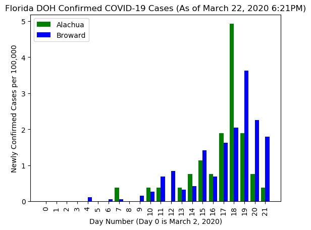

# COVID-19 in Florida

## Most Recent Retrospective Data
Using the code incldued in the repository, above are the charts created with the most recent public information. 
Alachua County and Broward County are included for reference since they are locations with the highest rates and of interest to the author (lives in Alachua County). 

## About this Repository
This repository is a collection of open source resources developed to conduct retrospective analysis on confirmed cases of COVID-19 by the Florida Department of Health in 2020. 
The data used for these analyses come directly from the public reports taken from the Florida DOH website for open consumption. 
Because the public data has been disseminated in PDF form, some transcription and manipulation was requred to reproduce into format for this analysis. Within the subrepositories for each particualr data release (each folder is named with the month day and time) there is full documentation of the raw data and tseps taken to transcribe into a usable format. 

## Disclaimer
While the author (Andrew Cistola) is a Florida DOH employee and a University of Florida PhD student, these are NOT official publications by the Florida DOH, the University of Florida, or any other agency. 
No information is included in this repository that is not available to any memeber of the public. 
All information in this repository is available for public review and dissemination. 