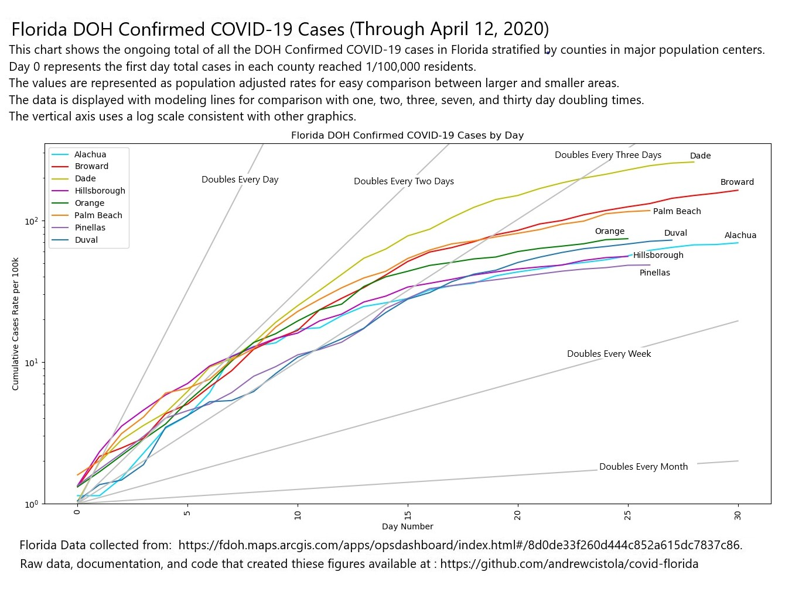

# COVID-19 in Florida - Updated April 13, 2020 1:15pm

### new_daily.csv
This file contains the number of cases newly confirmed each day by County in Florida as well as statewide total through the most recent data update. This dataset is created using the raw public file and then used to create visuals with code contained in this repository. Day 0 for Florida was March 2, 2020. 

## About this Repository
This repository is a collection of open source resources developed to conduct retrospective analysis on confirmed cases of COVID-19 by the Florida Department of Health in 2020. 
The data used for these analyses come directly from the public reports taken from the Florida DOH website for open consumption. You can reference the documentation in the raw data folders for each day for notes and sources.
Each folder in the repository contains updated data through the date and time listed in the name as well as code and figures specific for that data release. 

## Other Repositories
Non-florida data is collected from the following repositories:

#### [Johns Hopkins University Center for Systems Science and Engineering: https://github.com/CSSEGISandData/COVID-19](https://github.com/CSSEGISandData/COVID-19)
#### [New York City Department of Health and Mental Hygiene: https://github.com/nychealth/coronavirus-data](https://github.com/nychealth/coronavirus-data)

## Disclaimer
While the author (Andrew Cistola) is a Florida DOH employee and a University of Florida PhD student, these are NOT official publications by the Florida DOH, the University of Florida, or any other agency. 
No information is included in this repository that is not available to any member of the public. 
All information in this repository is available for public review and dissemination but is not to be used for making medical decisions. 