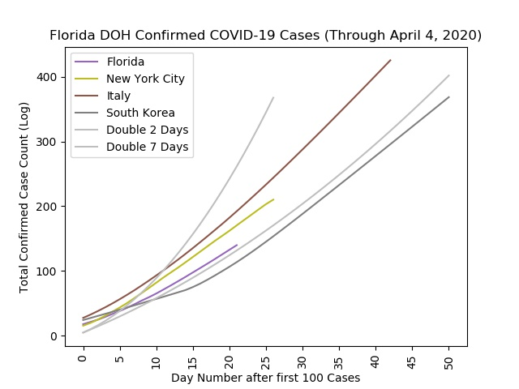

# COVID-19 in Florida

## Most Recent Retrospective Data
Using the code incldued in the repository, above is the chart created with the most recent public information.  

## About this Repository
This repository is a collection of open source resources developed to conduct retrospective analysis on confirmed cases of COVID-19 by the Florida Department of Health in 2020. 
The data used for these analyses come directly from the public reports taken from the Florida DOH website for open consumption. You can reference the documentation in the raw data folders for each day for notes and sources.

## Disclaimer
While the author (Andrew Cistola) is a Florida DOH employee and a University of Florida PhD student, these are NOT official publications by the Florida DOH, the University of Florida, or any other agency. 
No information is included in this repository that is not available to any member of the public. 
All information in this repository is available for public review and dissemination but is not to be used for making medical decisions. 